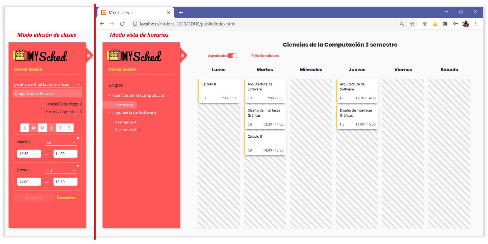
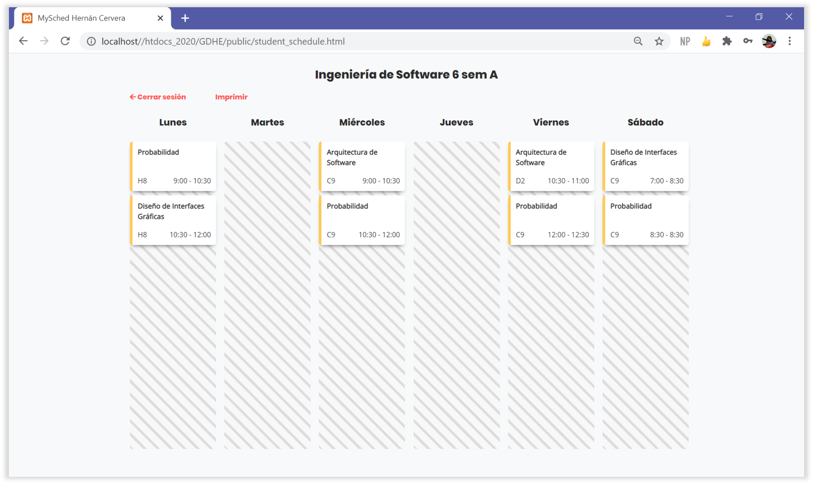

# Generador de Horarios Escolares

College project for Software Quality Assurance course, at UADY. Provided a set of academic groups, the web app allows creating and assigning classes to such groups.

## Backend

⭐ Main collaborator: (myself) [HerCerM](https://github.com/HerCerM)

* [Design](docs/services_api_docs.md) and [implement](src/services) a web API for the system.
* [Database design](resources/gdhe_schema.sql), [data loading](resources/populate.sql) and connection.
* [Unit test](tests) the API endpoints.

The web API is not RESTful, but it was developed in a  design-first approach.

Another note worthy task:

* Define [Collaborators contribution workflow](https://github.com/HerCerM/GDHE/wiki/Collaborators-contribution-workflow), inspired in GitHub Flow (not Gitflow).

## Frontend

⭐ Main collaborator: [JefApr](https://github.com/JefApr)

### Class assignment and edition

This is the view of the admin. Here, he or she can see the existing schedules and edit any one of them. The left red bar changes when editing a schedule.

<p align="center">
    
</p>


### Academic schedule of a student

A student the classes assigned to his or her group. Additionally, they can also print the schedule. A similar view is provided por professors, showing the classes they are assigned to teach.

<p align="center">
    
</p>

## Run and Build

The following requirements are necessary to build our project.

### Development requirements

 - Composer  
 - Node Js
 - XAMPP

### Execution of the project 

1. Get all PHP dependencies with Composer. We must execute the following command inside the root of the project 
``` bash 
composer install
```

2. Obtain the necessary dependencies of Node Js. We must execute the following command inside the root of the project 
``` bash 
npm install
```

3. To generate the necessary Javascript bundles we must execute the following command 
``` bash 
npm run build
```
4. Start the server and the database with the XAMPP tool.
